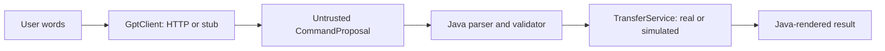

# Milestone 5: GPT command interpretation

**Current status, September 21:** this is the historical milestone 5 checkpoint. Subsequent explanation HTTP work and milestone 7 are committed on `feature/LLM-integration`. [Milestone 8](person-3-milestone-8.md) adds explicit live-evaluation infrastructure and updates command instructions to `commands-v2`; formal live outputs still need to be run and reviewed. The user's September 20 smoke observations are recorded separately there. Stop before milestone 9.

This step adds interpretation in front of the milestone 3 validator and milestone 4 CLI. It does not change the UDP engine or implement Person 2's measurements/logging. Generated, evidence-grounded explanations remain milestone 6 work. Live model quality evaluation remains milestone 8 work.

## Follow one request

For a console line such as `Send report to receiver-a with a 64 KiB window`:

1. `TransferCli` creates a Java request UUID. It supplies the user's words, approved file/receiver IDs and the current/last application IDs to a `GptClient`.
2. The real client sends a Responses API request; the offline stub returns a scripted proposal. Neither client has a reference to the transfer service or engine.
3. A proposed `start_transfer` might contain `file_id=report`, `receiver_id=receiver-a`, `window_bytes=65536`, and `timeout_ms=null`.
4. `CommandDispatcher` checks the entire proposed call list before executing anything. Its existing parser/validator checks JSON, IDs, file access, bounds and defaults. The request UUID prevents repeated start attempts for that logical request.
5. Only an accepted Java result updates the CLI's current selection and prints `Start accepted`. The existing worker then performs the UDP transfer independently.



The wrapper does not execute OpenAI tool calls automatically or ask GPT to describe an execution result. `status` prints Java's snapshot. `explain` selects Java's frozen outcome plus the question, exactly as before; the later explanation request is not implemented here.

## Where the code lives

All new GPT code is in `src/main/java/nettransfer/llm`:

| File | Responsibility |
| --- | --- |
| `GptClient.java` | Small injectable interface: interpretation request in, untrusted command proposal out |
| `InterpretationRequest.java` | Immutable, bounded user text, approved IDs, current/last IDs and clarification history; no source paths or file contents |
| `StubGptClient.java` | Offline queue of proposals; records immutable request snapshots for tests; exhaustion fails without replaying an earlier proposal |
| `GptSettings.java` | Model, finite connect/request deadlines and bounded attempts; reads non-secret settings from the environment |
| `GptException.java` | Typed, fixed error messages that do not include credentials, provider bodies or raw exception causes |
| `ResponsesGptClient.java` | HTTP request, prompts, three strict tool schemas, retries and decoding into proposals |
| `ResponsesJson.java` | Strict response-envelope parsing, duplicate-key/depth checks and credential checks |
| `ResponsesBodySubscriber.java` | Bounded response body collection so a stalled or oversized body cannot wait or grow indefinitely |

`src/main/java/nettransfer/cli/TransferCli.java` gains an injected `GptClient`, natural-language routing and a small pending clarification conversation. Its existing four-argument constructor remains an offline/direct-only option; the five-argument constructor accepts either client.

`src/main/java/nettransfer/cli/TransferCliMain.java` creates the environment-configured client. Missing or invalid optional GPT settings leave the console usable for direct commands. There are no new dependencies or changes to `pom.xml`, `nettransfer.Main`, the transfer engine, networking, the shared service contract, or the deterministic command validator/dispatcher.

## Important choices

**The three tools are proposals.** The permitted names are `start_transfer`, `status`, and `explain`. Each schema has `strict: true`, every property is required, and `additionalProperties: false`. Nullable settings/IDs keep their existing Java meaning. `parallel_tool_calls: false` asks the API for at most one call, and Java independently rejects a multi-call response before dispatch. This follows the [official function-calling guide](https://developers.openai.com/api/docs/guides/function-calling).

**The configured model is a starting point.** The default remains the handoff's `gpt-5-mini`, which supports Responses and function calling according to the [official model reference](https://developers.openai.com/api/docs/models/gpt-5-mini). `OPENAI_MODEL` can change it. Offline tests establish the integration behavior; they do not establish account access or interpretation accuracy for a live model.

**Prompts contain only what interpretation needs.** The application supplies approved IDs, the user's text and a small Java-selected context. It never reads a transfer file into a prompt or sends paths/network destinations from the configuration. The model must ask for missing file/receiver information even when only one resource is configured. Units distinguish KB (1,000 bytes) from KiB (1,024 bytes), with integer byte/millisecond output. `catalog` lets the human see the actual configured paths locally.

**Clarification has a limited lifetime.** Up to two prior user/question exchanges are retained under the same Java request UUID. A further clarification asks the user to restate the full request instead of silently forgetting its beginning. Execution, rejection, unsupported output, API failure or any direct command clears the pending history. New requests get new UUIDs. Use `ask <sentence>` when the sentence starts with a reserved direct command such as `status`.

**API retry cannot start a second transfer.** Retries occur inside the interpreter before it returns any proposal. They reuse one HTTP body and Java request UUID. The CLI dispatches once after interpretation completes, and the existing dispatcher also rejects a repeated start attempt with the same UUID. Transient connection failures, timeouts and selected HTTP errors have bounded retries; authentication/configuration errors do not. There is no recursive model/tool execution loop.

**API failure is separate from transfer failure.** Missing credentials, authentication, rate limits, transport failures, refusals, incomplete responses and invalid output have explicit non-executing outcomes. Plain model text is labelled `Model clarification (no command dispatched)`. Mixed text/tool output and unexpected output types fail closed. Malformed tool arguments still cross the strict Java parser and cannot bypass validation.

**Waiting is bounded, but interpretation is synchronous.** The default is two attempts, each with a 30-second request deadline, separated by a 100 ms backoff. A separate five-second connect deadline also applies. The request deadline covers the body, not just headers; HTTP response storage is capped at 1 MiB. The UDP worker keeps running during GPT interpretation. The console processes its next line after interpretation returns; this step does not implement concurrent console commands during an API wait.

**Secrets stay outside the source tree.** Only the Authorization header carries the configured API key. The adapter does not log raw requests/responses, headers or exception causes; an exact configured key echoed in input/output is rejected before it can be sent as prompt text or displayed. Requests use `store: false` and no server conversation ID. This is not a claim about provider retention policy. Prompt/schema version `commands-v1` and the Java request UUID accompany the request as metadata.

## Configuration for a later live session

No live OpenAI request is required to build or test this milestone. Once ready for a live session, set the key in the launching terminal, without putting it in Java, a tracked file or a literal shell-history entry:

```powershell
$gptKeyInput = Read-Host 'OpenAI API key' -AsSecureString
$env:OPENAI_API_KEY = [System.Net.NetworkCredential]::new('', $gptKeyInput).Password
Remove-Variable gptKeyInput
$env:OPENAI_MODEL = 'gpt-5-mini'
$env:OPENAI_CONNECT_TIMEOUT_MS = '5000'
$env:OPENAI_REQUEST_TIMEOUT_MS = '30000'
java -cp target/udp-file-transfer.jar nettransfer.cli.TransferCliMain . 'report=data/input/report.txt'
```

API deadlines accept integer milliseconds from 100 to 120,000. They do not change the UDP retransmission timeout. A configured production client always uses `https://api.openai.com/v1/responses` and does not follow redirects. A package-private loopback endpoint is available only for offline tests. Without a key, direct JSON commands, `help`, `catalog` and `status` still work; natural-language requests report `MISSING_CREDENTIALS`.

The input file must already exist under `data/input`. Start a fresh receiver with an unused output filename as described in the README before requesting a real transfer. Remove the process-local credential afterward with `Remove-Item Env:OPENAI_API_KEY`.

## Offline verification

The new checks live in `src/test/java/nettransfer/llm/ResponsesGptClientTest.java`, `GptSettingsTest.java`, `src/test/java/nettransfer/cli/TransferCliGptTest.java`, and the extended `TransferCliMainTest.java`.

They exercise scripted proposals and a loopback HTTP server through the real Java HTTP client: request schemas, response handling, deadlines, retries, credential handling, clarification context and independent dispatch validation. The HTTP-to-CLI retry test returns a rate limit followed by a valid start, then verifies two API attempts produced exactly one simulated service start with the same Java request ID. These fixtures are explicitly synthetic; no live provider or real measured explanation is involved.

See the [checklist's milestone 5 verification record](person-3-task-checklist.md#5-add-the-gpt-api-wrapper-and-command-interpretation) for the completed test commands and counts.

## Review stop and next step

Review this interpretation boundary before proceeding. Milestone 6 would introduce a summary-provider interface and labelled fixtures, then generate explanations from a selected, frozen evidence record. Real saved summaries remain dependent on Person 2's agreed contract. Missing real measurements must continue to be reported as unavailable; simulated evidence must never replace a real run's evidence.
