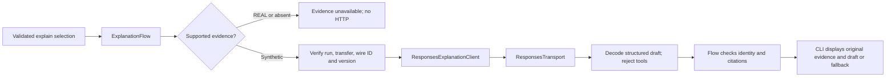

# Milestone 6 follow-up: separate explanation HTTP adapter

**Current status, September 21:** this HTTP implementation and subsequent milestone 7 are committed on `feature/LLM-integration`. The checkpoint/test/commit instructions below are historical. [Milestone 8](person-3-milestone-8.md) adds opt-in live evaluation and advances the analysis prompt to `explanations-v3`; formal live results still require review. Shared engine/metrics observations and identity plus real producer output remain pending. Stop before milestone 9.

This completes the remaining independent Person 3 component of milestone 6: sending an already selected evidence snapshot for analysis, and decoding the reply without giving it command authority. All verification uses authored **SYNTHETIC** evidence and a loopback HTTP server. No live OpenAI calls or new real experiment results are claimed. Milestone 7 has not started.

Person 2 has agreed to the complete [revised metric and supporting field set](Metrics_Summary_Revised.md). That agreement is preserved. Her actual saved summaries/logs and the concrete serialization, event, finalization and identity association contract are still pending. This HTTP adapter consumes the existing Person 3 analysis envelope; it is not a parser for her future files or an implementation of her metrics.

## Follow the code



1. Existing Java selection and provider checks run first. A wrong run/transfer/protocol mapping cannot become analysis evidence. The existing REAL gate remains in `ExplanationFlow`; even matching-ID synthetic evidence cannot explain a real run.
2. `ResponsesExplanationClient.payload` explicitly copies the question, terminal state/integrity, and evidence identity, provenance, capture time, fixture definition version, label and fields. It preserves numerical values as decimals, units, configured/observed kinds and explicit null/missing reasons. It does not calculate or fill in measurements.
3. The request uses the configured model, `store: false`, `tools: []`, `tool_choice: "none"`, and a strict JSON response schema under `text.format`. User question/field text goes in the user data message, separate from the instructions. There are no command schemas, approved file catalog, service objects, paths or file contents in this request.
4. The shared HTTP helper handles authentication, finite retries, deadlines, response limits and safe errors. It does not interpret commands or explanations. The command client and explanation client keep their own payloads and decoders.
5. The explanation decoder requires a completed response and exactly one completed assistant message with one JSON text part. It ignores reasoning items, rejects tool calls and ambiguous multiple messages, and reports refusal/incomplete output as failures. It rejects duplicate/extra JSON fields, wrong types, noncanonical UUID text, missing limitations and values exceeding the existing DTO bounds. It checks for echoed credentials in both the outer response and decoded inner JSON.
6. A decoded `ExplanationDraft` is still untrusted. `ExplanationFlow` checks its run/transfer identity and every structured field/value/unit citation against the original supplied evidence. A failed request or invalid draft leaves that valid evidence available for display. Neither the draft nor its prose enters the command dispatcher.

The Responses API's structured-output format was checked against the [official Structured Outputs guide](https://developers.openai.com/api/docs/guides/structured-outputs). Java still performs its own shape, bounds and evidence checks. API schema adherence alone cannot establish whether a prose claim follows from the evidence.

## Exactly what changed where

| File (under `src/main/java/nettransfer/`) | Change and reason |
| --- | --- |
| `llm/ResponsesExplanationClient.java` | New implementation of `ExplanationClient`: explicit evidence projection, tool-free structured request, strict response decoding and environment factory. Public construction uses the fixed official endpoint; a package-private loopback seam supports offline tests. |
| `llm/ResponsesTransport.java` | Extracts the existing command HTTP machinery into one package-private helper, so both clients use the same safeguards. |
| `llm/ResponsesGptClient.java` | Delegates HTTP to that helper; retains its command prompt, schemas, proposal parsing and Java dispatch path. |
| `llm/GptException.java` | Two fixed error messages now refer to a request/GPT rather than specifically to interpretation, because both clients use them. |
| `explanation/ExplanationRequest.java` | Versions the prompt as `explanations-v2`, states existing response limits/JSON expectations, preserves units/precision and distinguishes local fixture definitions from the eventual producer contract. |
| `explanation/ExplanationFlow.java` | Removes the inaccurate word "Offline" from the success display message. Its REAL gate, provider and citation checks are unchanged. |
| `cli/TransferCli.java` | Uses the transport-neutral label "Explanation draft (no command dispatched)". Explicit synthetic provenance remains visible beside evidence. |
| `cli/TransferCliMain.java` | Supplies the separate explanation client with `SummaryProvider.unavailable()`. Missing/invalid optional API configuration does not prevent console startup. Construction performs no HTTP request; the REAL gate/absent provider prevents production analysis until supported evidence integration exists. |

Tests are under `src/test/java/nettransfer/`:

- `llm/ResponsesExplanationClientTest.java`: 59 new loopback HTTP and flow integration cases.
- `cli/TransferCliMainTest.java`: two new tests for delayed missing/invalid explanation API configuration errors; seven tests total.
- `cli/TransferCliExplanationTest.java`: updates the one expected display label.

The README, handoff, original milestone 6 walkthrough and checklist now link this follow-up and distinguish HTTP implementation, live evaluation and real measured integration. Existing metrics review/Word documents were already in the working tree from the earlier discussion; this step does not revise them. No engine, real transfer adapter, logging, metric calculation, provider storage format, dependencies or `.gitignore` change is included.

## Important choices and limits

**Share transport, separate authority.** Copying the existing HTTP code would create two places to maintain deadlines, retry rules and credential handling. The shared helper handles bytes/HTTP only. Explanation output has a different return type and never becomes a command proposal.

**Keep exact supplied evidence.** `BigDecimal` values remain numbers with their supplied precision; missing values remain JSON null with a reason. The small precision test uses illustrative seconds/Mbps fields to verify transparent transport, not to claim coverage of the complete accepted producer metric set. The broader synthetic field-set audit belongs to milestone 7.

**Keep network work bounded.** The existing defaults remain `gpt-5-mini`, a 5-second connection timeout, a 30-second per-attempt request/body deadline and two attempts; existing environment settings apply to both clients. Responses are capped at 1 MiB with strict UTF-8 decoding. The explanation JSON text is additionally capped at 32,768 characters, and the request limits model output to 4,096 tokens. Default retries can occupy the console for roughly 60.1 seconds per API request while the transfer worker remains separate. Future natural-language explanations with supported evidence may make an interpretation request followed by a separate analysis request. Live testing must determine whether the output budget is sufficient; incomplete responses safely retain evidence.

**Do not enable unsupported real evidence.** Wiring the HTTP client does not unlock real explanations. The launcher uses the unavailable provider, and the flow blocks REAL outcomes before provider/client invocation. There is no production synthetic-mode switch or synthetic fallback. Current real `explain` requests still report `EVIDENCE_UNAVAILABLE`.

**Check citations; review prose.** Java verifies structured references, not the truth of arbitrary narrative. Instructions require acknowledgement of missing fields, separate hypotheses and causal limits. The CLI also displays original missing reasons and cautions. Live model adherence remains milestone 8 work.

## Verification

Run from the project root using the configured Java 17 installation and cached Maven dependencies:

```powershell
$env:JAVA_HOME = (Get-Content .vscode/settings.json -Raw | ConvertFrom-Json).'java.configuration.runtimes'[0].path
mvn -o '-Dtest=ResponsesExplanationClientTest,ResponsesGptClientTest,GptSettingsTest,TransferCliMainTest,TransferCliExplanationTest' test
mvn -o verify
```

The focused new adapter run passed **59 tests**. The existing command HTTP/settings run passed **77 tests** after transport extraction. New tests cover exact request evidence and identity, no tool authority, schema/JSON/type/size bounds, missing measurements, malformed/refused/incomplete responses, retries, stalled bodies, UTF-8, credentials, and rejection/preservation behavior through `ExplanationFlow`. Launcher tests verify that optional API configuration does not prevent direct console startup.

Final `mvn -o verify` on September 20, 2026 passed **498 tests across 29 classes**, with zero failures, errors or skips, and built `target/udp-file-transfer.jar`: the previous 437 tests plus 59 adapter/flow cases and two launcher cases. The first sandbox run had only the existing temporary-file Windows ACL error because the sandbox prevented changing its permissions; the approved rerun outside the sandbox passed that check too. The API key was cleared only in the test process. No live endpoint is used by the tests; only synthetic data and local HTTP/UDP endpoints are involved. The checklist records the earlier 437-test checkpoint separately.

## Review stop and local commit

Review `ResponsesExplanationClient` alongside its request/decoder tests, then the small launcher change and extracted transport. No commit or push has been performed. Do not start milestone 7 as part of this review.

After review, milestone 7 would first audit existing offline coverage, then add meaningful gaps using the accepted complete metric set and explicitly synthetic fixtures. Actual Person 2 output parsing, recorded measurement acceptance and engine identity/hooks integration remain pending under milestones 6 and 9. Live API evaluation remains milestone 8.

To commit this follow-up locally, inspect the working tree and stage the explicit files below. The metrics review documents were already untracked before this step; the second staging command includes them because the checklist/handoff link to the agreed set. Review those documents too, or commit that planning work separately first.

```powershell
git status --short
git diff --check
git diff
git add README.md docs/person-3-handoff.md docs/person-3-task-checklist.md docs/person-3-milestone-6.md docs/person-3-milestone-6-http.md
git add docs/Metrics_Summary_Revised.md docs/Metrics_Summary_Revised.docx docs/person-2-metrics-review.md
git add src/main/java/nettransfer/llm/ResponsesExplanationClient.java src/main/java/nettransfer/llm/ResponsesTransport.java src/main/java/nettransfer/llm/ResponsesGptClient.java src/main/java/nettransfer/llm/GptException.java
git add src/main/java/nettransfer/explanation/ExplanationRequest.java src/main/java/nettransfer/explanation/ExplanationFlow.java src/main/java/nettransfer/cli/TransferCli.java src/main/java/nettransfer/cli/TransferCliMain.java
git add src/test/java/nettransfer/llm/ResponsesExplanationClientTest.java src/test/java/nettransfer/cli/TransferCliMainTest.java src/test/java/nettransfer/cli/TransferCliExplanationTest.java
git diff --cached --check
git diff --cached --stat
git diff --cached
git commit -m "Add separate milestone 6 explanation HTTP adapter"
```

The generated, pre-existing untracked `dependency-reduced-pom.xml` is intentionally excluded. Avoid `mvn clean` if you want to keep milestone 4's disposable transfer/hash evidence under `target/`.
