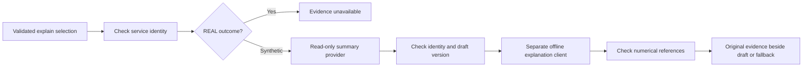

# Milestone 6: independent explanation boundary

**Current status, September 21:** milestone 6 HTTP work and milestone 7 are committed on `feature/LLM-integration`; older branch, pause, absent-client and staging instructions below are historical. [Milestone 8](person-3-milestone-8.md) adds explicitly enabled live evaluation and prompt `explanations-v3`; formal live results remain unreviewed. Actual producer evidence and shared engine/metrics observation and identity integration remain pending. Stop before milestone 9.

**Historical checkpoint:** this walkthrough records the original boundary committed as `ab3c4c0`, whose verification passed 437 tests. Its file-change lists, test counts and commit commands describe that checkpoint. The separate HTTP adapter is now implemented; see the [milestone 6 HTTP follow-up](person-3-milestone-6-http.md) for current changes, verification and commit guidance. Milestone 7 has not started.

**Current scope:** the user confirms Person 2 has accepted the complete [revised metric set and supporting fields](Metrics_Summary_Revised.md). Actual summaries/logs, serialization/events and verified engine/application identity mapping remain unavailable. The follow-up adds tool-free structured JSON analysis using prompt `explanations-v2` and shared bounded HTTP transport. Its launcher uses `SummaryProvider.unavailable()`, and the REAL-evidence gate still stops before the explanation client. All checks use synthetic fixtures and a local HTTP server; live quality and real measured explanations remain pending. References below to the original draft definitions and absent HTTP adapter describe the earlier checkpoint.

This step implements and tests the parts that do not depend on Person 2: selecting and checking evidence, a read-only summary provider, a separate explanation request/client, evidence-reference validation, and CLI rendering/fallback. The fixtures and scripted answers are explicitly **SYNTHETIC**. Real metric integration remains pending.

The assignment PDF requires explanations to cite recorded numerical measurements and display those measurements alongside the explanation. That describes the eventual integrated system. This step does not claim that fixtures satisfy the assignment's real experiments, logs or measured explanations.

## Follow one explanation

1. A direct `explain` command or the existing interpreter proposes a run and question. The parser and validator retain authority over selection.
2. `CommandDispatcher` loads the terminal service outcome and verifies its returned run ID. For default selection it also checks the selected transfer ID. A read-only `status` lookup cross-checks the returned run, transfer, evidence source and nullable protocol ID against the service's registration. Run and transfer IDs need not be equal.
3. `ExplanationFlow` receives that frozen outcome and question. **REAL outcomes immediately return `EVIDENCE_UNAVAILABLE`.** Person 2's contract and saved summaries are absent; the current in-memory outcome is not a replacement. The provider and explanation client are not called for a real outcome, even when a supplied synthetic fixture has the same IDs.
4. For an explicitly synthetic outcome, the provider loads only the requested run. Java checks both application IDs, provenance, nullable wire ID and the supported fixture-definition version. Wrong evidence is rejected before analysis or display as a valid source.
5. A new bounded `ExplanationRequest` carries the question, immutable evidence and terminal state/integrity to the independent `ExplanationClient`. It has no transfer service, execution tools, command history, source paths, network addresses or file contents. The provided client is an offline queue of scripted answers.
6. Java checks the answer's run/transfer IDs and every numerical citation's field ID, value and unit. Unknown fields, missing values, altered values or wrong units reject the draft. The CLI prints original supplied numbers, definitions, provenance, capture time and missing reasons beside accepted prose. Analysis failures retain those valid measurements; evidence failures do not display the rejected record.



An active run still returns `SUMMARY_NOT_READY`; an unknown run returns `UNKNOWN_TRANSFER`. Neither substitutes another run. An explicit historical run stays selected even while a different transfer is active.

For example, the **synthetic loss fixture** supplies these values:

| Supplied field | Value | Meaning in this fixture |
| --- | --- | --- |
| `configured_loss_percent` | 10 percent | Configured impairment probability |
| `retransmitted_packets` | 12 packets | Observed-kind fixture count of repeated DATA sends |
| `observed_drops` | unavailable | No drop observations supplied |

The scripted answer cites 10 percent and 12 packets while acknowledging the missing drop observations. It cannot establish the actual loss rate. The CLI prints these original fields and the run ID beside that answer. None of these numbers describes a real transfer.

## Exactly what changed

All new production types live under `src/main/java/nettransfer/explanation`:

| File | Responsibility |
| --- | --- |
| `RecordedSummary.java` | Immutable Person 3 analysis envelope with identity, capture time, draft version, fixture label and bounded numerical fields. Each field includes units, definition, `OBSERVED`/`CONFIGURED` kind and a missing reason when null. |
| `SummaryProvider.java` | Read-only `load(runId)` boundary; an empty result means no evidence. Default implementation supplies none. |
| `SyntheticSummaryProvider.java` | Immutable exact-run fixture lookup; rejects real entries, duplicate run IDs and unsupported definition versions. No automatic fallback or metric calculation. |
| `ExplanationRequest.java` | Bounded analysis input and versioned instructions requiring citations, missing-evidence acknowledgement and separation of observations from hypotheses. |
| `ExplanationClient.java` | Analysis-only injectable interface, separate from command interpretation. |
| `ExplanationDraft.java` | Bounded untrusted observations with numerical references, separate hypotheses, mandatory limitations and returned run/transfer identity. |
| `StubExplanationClient.java` | Offline scripted answers and captured requests; exhaustion fails without replaying an earlier answer. |
| `ExplanationFlow.java` | Real-evidence gate, provider/identity/version checks, client invocation, citation checks and typed fallback outcomes. |

Two existing production files change:

- `control/command/CommandDispatcher.java` cross-checks explanation identity before returning `SummarySelected`.
- `cli/TransferCli.java` accepts optional explicit `ExplanationFlow` injection, routes selected outcomes into it, and renders original evidence, references, hypotheses and limitations. Existing constructors use the unavailable default. Direct and interpreted explain requests reach the same flow.

No changes were made to the UDP engine, real adapter, fake transfer service, shared metric definitions, wire protocol, Maven dependencies, launcher or existing OpenAI HTTP wrapper. Synthetic fixtures are test code; there is no production command that replaces real evidence with them.

## Choices and limits

**A provider is separate from the transfer service.** The service's `summary` method already means a frozen in-memory terminal outcome. The new provider means recorded analysis evidence. Keeping both meanings explicit prevents treating file size and successful completion as a complete measurement report.

**The real gate is deliberate.** Adding a future provider alone cannot turn this into real analysis. After team agreement, integration must replace that gate, adopt the real schema and verify the actual application/wire identity mapping. Until then, even a record labelled REAL is unsupported. No storage loader, observer, logger or metric calculator is introduced here.

**These definitions are drafts.** `person-3-explanation-fixture-1` identifies the local fixture envelope. It does not approve the handoff's proposed goodput, retransmission ratio, RTT, overhead or timing definitions. Fixtures spell out their own meanings and pass numbers unchanged. Null is unavailable, never zero. The engine's existing `-1` counter normalization remains in the real adapter.

**Inputs and outputs are bounded.** A summary contains at most 32 unique fields, bounded labels/definitions/units and bounded nonnegative decimals. The question is limited to 2,000 characters. Answers have bounded observations, references, hypotheses and limitations. Lists/maps are copied so later caller changes cannot alter the analysis snapshot. No event excerpt is needed for these fixture cases; actual event parsing/selection waits for the agreed event contract.

**Analysis cannot execute commands.** The analysis interface has no tool-call return type or dispatcher. Command interpretation may select `explain`; the later analysis response is never passed back into command interpretation or execution.

**Citations are checked, prose still needs review.** Java verifies every structured numerical reference against the source, and renders source values rather than echoed model numbers. This does not prove every arbitrary prose claim true. Scripted fixture answers are checked offline; live model quality and a real explanation example remain pending. Hypotheses are labelled unproven. Java always displays missing-field reasons and cautions that configured loss is not observed loss, retransmissions are not a loss percentage, timeouts do not prove congestion, and one run cannot establish which setting is faster.

**HTTP adapter status at this checkpoint.** The original prompt contract and scripted client exercised the independent flow without an OpenAI call; the command HTTP adapter was unchanged. The [current follow-up](person-3-milestone-6-http.md) adds the separate tool-free explanation adapter and retains the identity/reference checks. Offline tests do not establish live output quality.

## Reading and verification

Read `RecordedSummary`, `SummaryProvider`, then `ExplanationFlow.explain`. Follow `SyntheticExplanationFixtures` and `ExplanationFlowTest` under `src/test/java/nettransfer/explanation`, then `TransferCliExplanationTest` under `src/test/java/nettransfer/cli`. The extended `CommandDispatcherTest` covers incorrect service identity and valid distinct run/transfer IDs.

The fixtures cover baseline, configured loss, configured delay, missing measurements and failure. Their values are illustrative test inputs, not experimental results. Tests verify identity/provenance rejection, unavailable real evidence, preservation of numbers/nulls, invalid citations, client/provider failure, immutable bounded input, historical selection and no transfer execution from analysis.

```powershell
mvn -o '-Dtest=nettransfer.explanation.*Test,nettransfer.cli.*Test,nettransfer.control.command.CommandDispatcherTest' test
mvn -o verify
```

Original checkpoint verified September 20, 2026: **61 new explanation/CLI tests** passed in the focused run; **18 dispatcher tests** passed separately, including five new identity checks. Its `mvn -o verify` passed **437 tests across 28 classes**, with zero failures/errors/skips, and built the JAR. The [checklist](person-3-task-checklist.md#6-ground-explanations-in-recorded-measurements) records commands and the approved rerun needed for the existing Windows ACL test. The full offline suite includes existing local UDP integration and loopback HTTP tests; it makes no live OpenAI calls. No new manual transfer is claimed, and milestone 4's saved hash evidence is preserved by avoiding `clean`. Current HTTP-adapter verification is recorded in the [follow-up](person-3-milestone-6-http.md).

## Original checkpoint review stop and local commit

The following notes and commands were for the original boundary, which is already committed. Use the [HTTP follow-up](person-3-milestone-6-http.md) for the current review stop, dependencies and local commit commands. The accepted revised metric set supersedes the earlier request to agree metric scope.

Stop here for review. Milestone 6 remains partially complete because consuming Person 2's actual outputs and agreed definitions is still pending. Milestone 7 and later milestones have not been started or checked off as part of this step.

Next, review the selection checks and fixture-to-explanation path. Then agree the summary/event definitions and identity hooks with Persons 1 and 2. When their outputs exist, write a real provider adapter, verify its mapping and schema, and check one real explanation beside its recorded evidence. A separate tool-free HTTP explanation transport and later opt-in live evaluation are additional work; they need not change the engine.

After reviewing the diff, commit locally with:

```powershell
git diff --check
git diff
git add README.md docs/person-3-handoff.md docs/person-3-task-checklist.md docs/person-3-milestone-6.md
git add src/main/java/nettransfer/explanation src/main/java/nettransfer/cli/TransferCli.java src/main/java/nettransfer/control/command/CommandDispatcher.java
git add src/test/java/nettransfer/explanation src/test/java/nettransfer/cli/TransferCliExplanationTest.java src/test/java/nettransfer/control/command/CommandDispatcherTest.java
git diff --cached --stat
git diff --cached
git commit -m "Add offline milestone 6 evidence and explanation boundary"
```

The pre-existing untracked `dependency-reduced-pom.xml` is a generated Maven artifact and is intentionally excluded. No commit or push was performed by the assistant.
